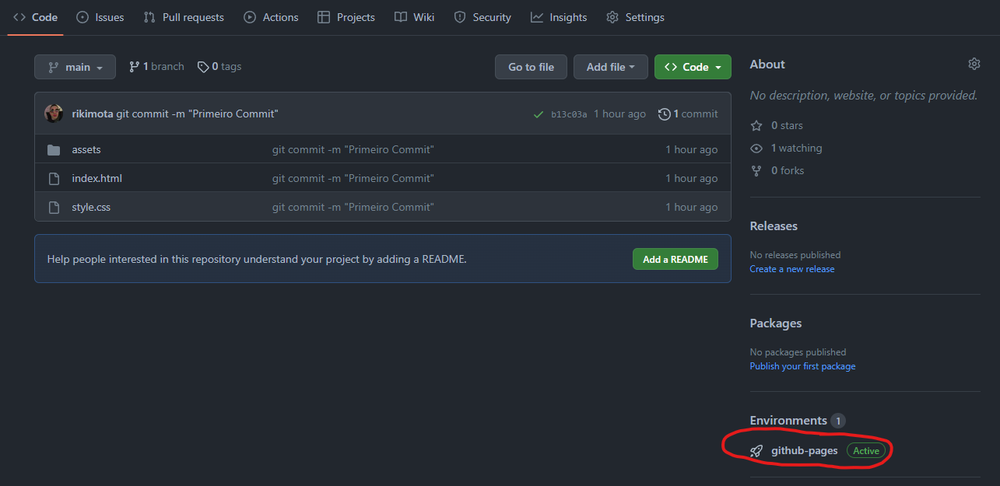
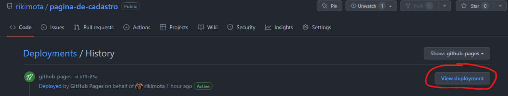

<h1 align="center">Página de Cadastro</h1>

Página de cadastro feita utilizando HTML e CSS.

### Versão para Web

### Versão Mobile

## Como visualizar

Para visualizar o resultado da página em seu computador siga os passos:

### 1-Clique em 'github-pages'

### 2-Vá em 'View deployment'

---

##### Coded by Henrique Mota